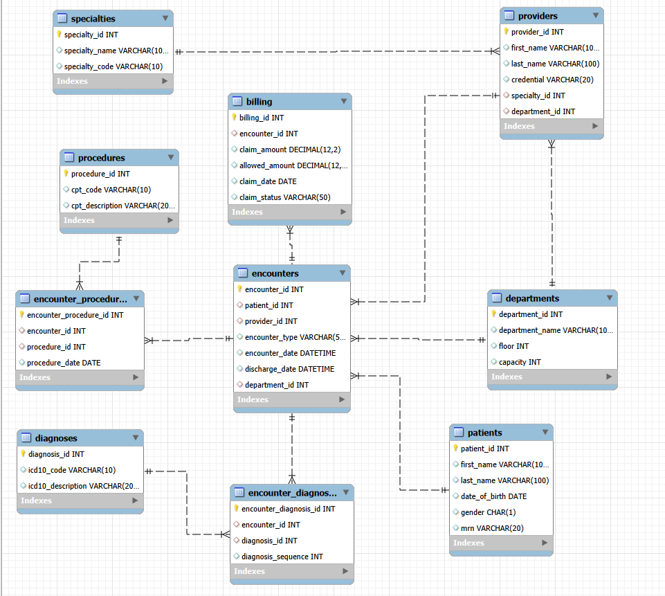

# Healthcare Analytics Lab: OLTP to Star Schema

## Overview
You've joined HealthTech Analytics as a junior data engineer. The clinical team built a normalized transactional database (3NF), but analytics queries are slow. Your job: analyze the OLTP schema, identify performance issues, then design and build an optimized star schema.

## Database Schema (ERD)



The normalized schema consists of 10 tables with the following relationships:
- **Central table**: `encounters` links patients, providers, departments, and billing
- **Dimension tables**: `patients`, `providers`, `specialties`, `departments`
- **Junction tables**: `encounter_diagnoses`, `encounter_procedures` (many-to-many)
- **Lookup tables**: `diagnoses` (ICD-10 codes), `procedures` (CPT codes)
- **Transaction table**: `billing` (financial data per encounter)

## Project Structure

### Part 1: Normalized OLTP Schema
Study the production system's 10 normalized tables (patients, specialties, departments, providers, encounters, diagnoses, procedures, encounter_diagnoses, encounter_procedures, billing) and understand how data is organized.

### Part 2: Find the Performance Problem
Write SQL queries to answer 4 business questions using the normalized schema:
1. **Monthly Encounters by Specialty** - Total encounters and unique patients by encounter type
2. **Top Diagnosis-Procedure Pairs** - Most common diagnosis-procedure combinations
3. **30-Day Readmission Rate** - Which specialty has the highest readmission rate
4. **Revenue by Specialty & Month** - Total allowed amounts by specialty and month

Run queries, measure performance, and identify bottlenecks.

### Part 3: Design the Star Schema
Design an optimized dimensional model including:
- Dimension tables (date, patient, provider, specialty, department, encounter type)
- Fact table with pre-aggregated metrics
- Bridge tables for many-to-many relationships
- Rewrite all 4 queries for the star schema
- Document ETL logic

### Part 4: Analysis & Reflection
Compare normalized vs. denormalized performance, analyze trade-offs, and quantify improvements.

## Deliverables
- ☐ `query_analysis.txt` - 4 queries with performance analysis
- ☐ `design_decisions.txt` - Design choices documented
- ☐ `star_schema.sql` - Complete DDL for star schema
- ☐ `star_schema_queries.txt` - 4 optimized queries with performance comparison
- ☐ `etl_design.txt` - ETL pseudocode/narrative
- ☐ `reflection.md` - 1-2 page analysis

## Quick Start

### 1. Create the OLTP Schema
Run the DDL statements from `Instruction.txt.txt` to create all tables.

### 2. Load Sample Data
Execute the data generation script:
```sql
SOURCE generated_10k_sample_data.sql;
```

### 3. Verify Data
```sql
SELECT 'Patients' AS table_name, COUNT(*) AS record_count FROM patients
UNION ALL SELECT 'Encounters', COUNT(*) FROM encounters
UNION ALL SELECT 'Providers', COUNT(*) FROM providers
UNION ALL SELECT 'Departments', COUNT(*) FROM departments;
```

## Sample Data
- **20 medical specialties** across 15 hospital departments
- **1,000 providers** with Ghanaian names
- **10,000 patients** with Ghanaian names
- **10,000 encounters** (Outpatient, Inpatient, ER)
- **50+ ICD-10 diagnosis codes** and 40+ CPT procedure codes
- **Date range**: January 1 - December 31, 2024

---

**Database**: MySQL
**Focus**: Real-world data engineering - performance analysis & dimensional modeling
