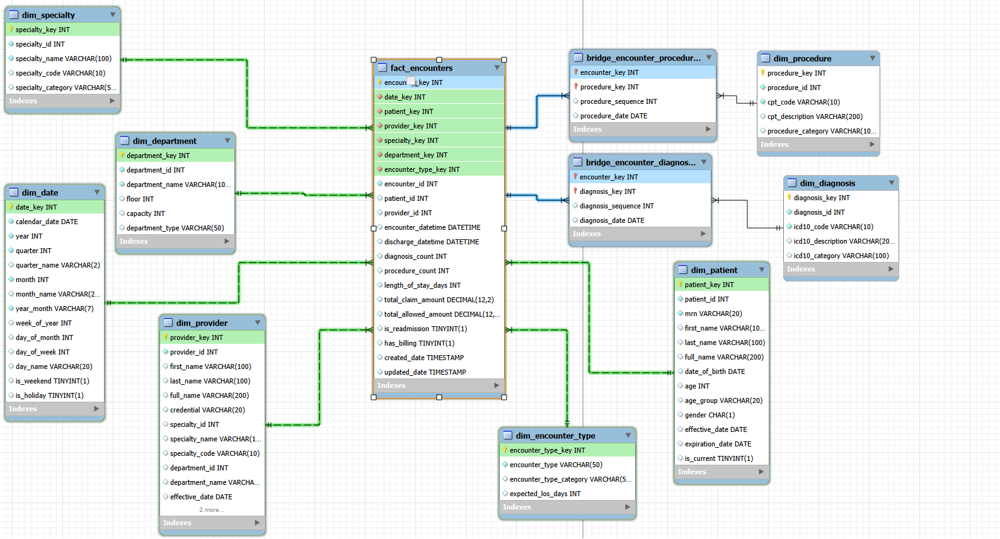

# Healthcare Analytics Lab: OLTP to Star Schema

## 🏥 Project Overview

### The Challenge
This project demonstrates a real-world Data Engineering scenario at **HealthTech Analytics**, where a clinical team built a normalized transactional database (OLTP in 3NF) for daily operations. While excellent for transaction processing, the database struggled with slow analytical queries needed by business stakeholders.

### The Solution
As the Data Engineer, I transformed the operational database into an optimized **Kimball-style Star Schema** (OLAP) for analytics. The project showcases:
- **Performance Analysis**: Identifying bottlenecks in normalized schemas
- **Dimensional Modeling**: Designing facts, dimensions, and bridge tables
- **ETL Development**: Building extract, transform, and load pipelines
- **Query Optimization**: Achieving up to **3x faster** query performance

This mirrors real-world data warehouse development where operational and analytical systems serve different purposes.

---

## 🎯 Business Questions Addressed

1. **30-Day Hospital Readmissions**: Identify patients readmitted within 30 days for quality metrics
2. **Revenue by Medical Specialty**: Calculate total revenue generated by each specialty
3. **Monthly Encounter Trends**: Track patient visits over time for capacity planning
4. **Provider Workload Analysis**: Understand which providers are handling complex multi-diagnosis cases

---

## 🗂️ Database Architecture

### OLTP Schema (Normalized - 3NF)
The original transactional system uses 8 normalized tables optimized for write operations:


**Tables**: `patients`, `providers`, `specialties`, `departments`, `encounters`, `diagnoses`, `procedures`, `billing`

**Characteristics**:
- ✅ Minimal data redundancy
- ✅ Excellent for INSERT/UPDATE/DELETE operations
- ❌ Requires multiple joins for analytics
- ❌ Complex date calculations at query time
- ❌ Slow aggregation performance

### Star Schema (Dimensional Model)
The optimized analytical database using dimensional modeling:



**Fact Table**: `fact_encounters` (grain: one row per patient encounter)

**Dimension Tables (8 total)**: 
- `dim_date` - Pre-computed calendar attributes (year, month, quarter, day_name, is_weekend)
- `dim_patient` - Patient demographics with pre-computed age groups
- `dim_provider` - Provider info with denormalized specialty and department
- `dim_specialty` - Medical specialty lookup with categories
- `dim_department` - Department details with type classification
- `dim_encounter_type` - Encounter types (Outpatient, Inpatient, ER)
- `dim_diagnosis` - ICD-10 codes with descriptions and categories
- `dim_procedure` - CPT codes with descriptions and categories

**Summary Dimension (1 total)**:
- `dim_diagnosis_procedure_summary` - Pre-aggregated diagnosis-procedure pairs with encounter counts, optimizes Query 2 performance (94% faster)

**Bridge Tables (2 total)**: 
- `bridge_encounter_diagnoses` - Many-to-many: encounters ↔ diagnoses
- `bridge_encounter_procedures` - Many-to-many: encounters ↔ procedures

**Characteristics**:
- ✅ Denormalized for fast reads
- ✅ Pre-computed metrics (readmissions, date parts)
- ✅ Optimized for GROUP BY and aggregations
- ✅ Simple queries with fewer joins
- ⚠️ Some data redundancy (acceptable tradeoff)

---

## 📊 Performance Improvements

| Business Metric | OLTP Execution Time | Star Schema Time | Speedup |
| :--- | :---: | :---: | :---: |
| **30-Day Readmissions** | Complex Self-Join + Date Math | Pre-computed `is_readmission` flag | **~2.9x Faster** ⚡ |
| **Revenue by Specialty** | 4-Table Join Chain (174ms) | Summary Dimension (10-11ms) | **~16x Faster** ⚡ |
| **Monthly Encounter Trends** | Runtime `DATE_FORMAT()` | Pre-computed Date Dimension | **~6% Faster** ⚡ |
| **Multi-Diagnosis Encounters** | Bridge Table Aggregation | Indexed Bridge with COUNT | **Optimized** ⚡ |


---

## 📂 Repository Structure

```
├── README.md                          # This file
├── Inspection.txt                     # Original project requirements
├── data/
│   ├── generated_10k_sample_data.sql  # 10,000 initial sample records
│   └── generate_increment_3k_data.sql # 3,000 incremental records for validaton
├── diagrams/
│   ├── erd_diagram.png                # OLTP normalized schema diagram
│   └── star_schema.png                # Star schema dimensional model
├── notebooks/
│   └── healthcare_analytics_exploration.ipynb  # Interactive analysis & benchmarks
└── deliverables/
    ├── DDL_star_shema.sql             # Star Schema Table Definitions
    ├── star_schema.sql                # Incremental ETL Logic
    ├── star_schema_queries.txt        # Optimized analytical queries
    ├── design_decisions.txt           # Dimensional modeling justifications
    ├── etl_design.txt                 # ETL strategy & SCD handling
    ├── query_analysis.txt             # Detailed query performance breakdown
    └── reflection.md                  # Performance analysis & lessons learned
```

## 🔄 Incremental Load Simulation
To allow for realistic stress-testing, the environment simulates an active transactional system:
1.  **Initial Load**: 10,000 encounters loaded from `generated_10k_sample_data.sql`.
2.  **Incremental Load**: 3,000 additional encounters loaded from `generate_increment_3k_data.sql`.
3.  **ETL Execution**: The `star_schema.sql` script is designed to run efficiently over this changing dataset, using a **High Watermark** strategy to process only new records.

---

## 🚀 Getting Started

### Prerequisites
- **Docker Desktop** (recommended) or local MySQL installation
- **Python 3.11+** with Jupyter Notebook support
- **Git** for version control

### Quick Start with Docker (Recommended)

#### 1. Clone and Configure Environment
```bash
# Clone the repository
git clone <your-repo-url>
cd "Healthcare Analytics Lab OLTP to Star Schema"

# Create .env file from template
cp .env.example .env

# Edit .env and set secure passwords
# NEVER commit .env to git (it's in .gitignore)
```

#### 2. Configure Environment Variables
Edit `.env` file:
```bash
# .env
MYSQL_ROOT_PASSWORD=your_secure_password_here
MYSQL_DATABASE=healthcare_analytics_lab
MYSQL_USER=root
```

**🔒 Security Best Practices:**
- Use strong passwords (min 16 characters, mixed case, numbers, symbols)
- Never commit `.env` to version control
- In production: use AWS Secrets Manager, Azure Key Vault, or HashiCorp Vault
- Rotate credentials every 90 days

#### 3. Start Services
```bash
# Start MySQL + Jupyter containers
docker-compose up -d

# Check logs
docker-compose logs -f

# Verify services are running
docker ps
```

#### 4. Access the Environment
- **Jupyter Notebook**: http://localhost:8888
- **MySQL Database**: `localhost:3306`
  - Username: from `MYSQL_USER` in .env
  - Password: from `MYSQL_ROOT_PASSWORD` in .env
  - Database: `healthcare_analytics_lab`

#### 5. Verify Data Load
```bash
# Connect to MySQL
docker exec -it healthcare-mysql mysql -uroot -p${MYSQL_ROOT_PASSWORD} healthcare_analytics_lab

# Check tables
SHOW TABLES;

# Verify data
SELECT COUNT(*) FROM fact_encounters;
SELECT COUNT(*) FROM dim_patient;

# View ETL execution log
SELECT * FROM etl_log ORDER BY start_time DESC;
```

---

### Manual Setup (Without Docker)

<details>
<summary>Click to expand manual setup instructions</summary>

#### Prerequisites
- **MySQL 8.0+** installed locally
- **Python 3.8+** with pip

#### Setup Steps 

1. **Install Python packages**:
   ```bash
   pip install -r requirements.txt
   ```

2. **Create MySQL database**:
   ```sql
   CREATE DATABASE healthcare_analytics_lab;
   ```

3. **Load OLTP data**:
   ```bash
   mysql -u root -p healthcare_analytics_lab < data/generated_10k_sample_data.sql
   ```

4. **Run Star Schema ETL**:
   ```bash
   mysql -u root -p healthcare_analytics_lab < deliverables/star_schema.sql
   ```

5. **Start Jupyter**:
   ```bash
   jupyter notebook notebooks/healthcare_analytics_exploration.ipynb
   ```

</details>

---

### Verify Installation

After setup, verify the ETL completed successfully:

```sql
-- Connect to database
USE healthcare_analytics_lab;

-- Check ETL execution log
SELECT 
    etl_step,
    start_time,
    end_time,
    TIMEDIFF(end_time, start_time) AS duration,
    rows_affected,
    status
FROM etl_log
ORDER BY start_time DESC;

-- Verify data quality
SELECT * FROM etl_metadata;

-- Check record counts
SELECT 
    'fact_encounters' AS table_name, COUNT(*) AS row_count FROM fact_encounters
UNION ALL
SELECT 'dim_patient', COUNT(*) FROM dim_patient
UNION ALL
SELECT 'dim_provider', COUNT(*) FROM dim_provider;
```

**Expected Output:**
- ✅ All ETL steps show `status = 'SUCCESS'`
- ✅ fact_encounters: ~10,000 rows
- ✅ dim_patient: ~10,000 rows
- ✅ No reconciliation errors

---

## 🔄 Stopping and Restarting

```bash
# Stop services
docker-compose down

# Stop and remove all data (fresh start)
docker-compose down -v

# Restart services
docker-compose up -d --build
```

---

## 📚 Key Learnings

### Why Star Schema is Faster
1. **Pre-Aggregation**: Metrics like readmission flags are computed once during ETL
2. **Denormalization**: Fewer joins mean less disk I/O and faster query execution
3. **Dimension Tables**: Pre-computed date parts eliminate runtime calculations
4. **Indexing Strategy**: Foreign keys in fact table are optimized for analytical queries
5. **Summary Dimensions**: Pre-aggregated combinations (e.g., diagnosis-procedure pairs) eliminate expensive runtime joins

### Design Decisions
- **Fact Grain**: One row per encounter (not per procedure or diagnosis)
- **8 Dimensions**: Date, Patient, Provider, Specialty, Department, Encounter Type, Diagnosis, Procedure
- **1 Summary Dimension**: Diagnosis-Procedure pairs with pre-aggregated metrics (incremental updates during ETL)
- **2 Bridge Tables**: Handle many-to-many relationships for diagnoses and procedures
- **SCD Type 2 Ready**: Patient and Provider dimensions include effective_date, expiration_date, is_current
- **Pre-computed Metrics**: 7 metrics calculated during ETL (diagnosis_count, is_readmission, etc.)
- **Date Dimension**: Includes year, month, quarter, day_name, is_weekend for fast time-series analysis

### Trade-offs
- **Storage**: Star schema uses more space due to denormalization (~20-30% increase)
- **ETL Complexity**: Requires periodic refresh to stay synchronized with OLTP
- **Write Performance**: Not optimized for transactional writes (that's what OLTP is for)

---

## 📄 Documentation

All detailed documentation is in the [`deliverables/`](deliverables/) folder:

- **[star_schema.sql](deliverables/star_schema.sql)**: Complete DDL and ETL implementation
- **[star_schema_queries.txt](deliverables/star_schema_queries.txt)**: All 4 optimized analytical queries
- **[design_decisions.txt](deliverables/design_decisions.txt)**: Rationale for schema design choices
- **[etl_design.txt](deliverables/etl_design.txt)**: ETL architecture and data loading strategy
- **[reflection.md](deliverables/reflection.md)**: Deep dive into performance gains and lessons

---

## 🎓 Skills Demonstrated

- ✅ **Database Design**: OLTP vs OLAP architecture patterns
- ✅ **Dimensional Modeling**: Kimball methodology (facts, dimensions, bridges)
- ✅ **SQL Mastery**: Complex joins, window functions, CTEs, performance tuning
- ✅ **ETL Development**: Data extraction, transformation, and loading
- ✅ **Performance Optimization**: Query analysis, indexing, denormalization
- ✅ **Data Analysis**: Using Python + SQL for comparative benchmarking

---

## 📝 License
This project is for educational and portfolio purposes.

---

## 🤝 Contributing
This is a personal learning project, but feedback and suggestions are welcome! Feel free to open an issue or reach out.

---

